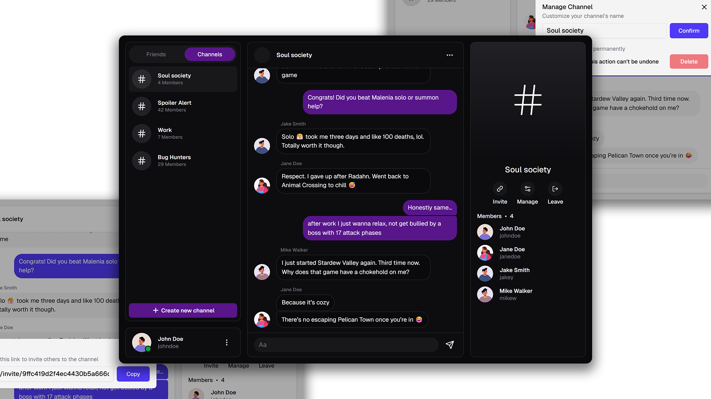

# TELEX

Telex is a full-stack real-time chat application built with React.




## Features

- **Authentication System**
  Secure user registration with email confirmation
- **User Status Management**
  Customize your online presence
- **Social Interactions**
  Add friends by username
  Direct messaging
- **Message Management**
  Edit and delete sent messages
- **Channel Creation**
  Create channels with shareable join links
  Admin roles with message deletion and user management privileges

## Tech Stack

#### Backend

- **Language & Framework**: Node.js with Express
- **Database**: PostgreSQL
- **ORM**: Prisma
- **Key Dependencies**:
  - `@prisma/client`
  - `bcryptjs`
  - `crypto`
  - `express`
  - `jsonwebtoken`
  - `nodemailer`
  - `socket.io`

#### Frontend

- **Framework**: React + Vite
- **Language**: TypeScript
- **Styling**: Tailwind CSS v4
- **State Management**:
  - React Query
  - React Context
- **HTTP Client**: Axios
- **Key Dependencies**:
  - `react`
  - `react-router-dom`
  - `@tanstack/react-query`
  - `socket.io-client`

## Installation Guide

### Prerequisites

1. **Email Configuration**

   - Create a Google Account
   - Generate an App Password:
     - Go to Google Account > Security
     - Enable 2-Step Verification
     - Go to App Passwords
     - Select "Mail" and your device
     - Copy the generated 16-character password

2. **Database Setup**
   - Option 1: Local PostgreSQL database
   - Option 2: Create a free Neon.tech PostgreSQL database

### Installation Steps

##### 1. Clone the repository

```bash
git clone https://github.com/Sulkhans/Telex.git
cd Telex
```

##### 2. Install Backend Dependencies

```bash
npm install
```

##### 3. Create `.env` File

```
PORT=5000
NODE_ENV=development
JWT_SECRET={your_jwt_secret}
CORS_ORIGIN={http://localhost:5173}
DATABASE_URL={your_database_connection_string}
EMAIL_USER={your_google_email@gmail.com}
EMAIL_PASS={your_generated_app_password}
```

##### 4. Install Frontend Dependencies

```bash
cd frontend
npm install
```

##### 5. Run the Application

```bash
# From project root
npm run backend  # Starts backend server
npm run frontend # Starts frontend development server
```

##### 6. Access the Application

The application will be available at `http://localhost:5173`

### Notes

- Confirmation emails might be filtered to the spam folder
- Ensure all environment variables are correctly configured
